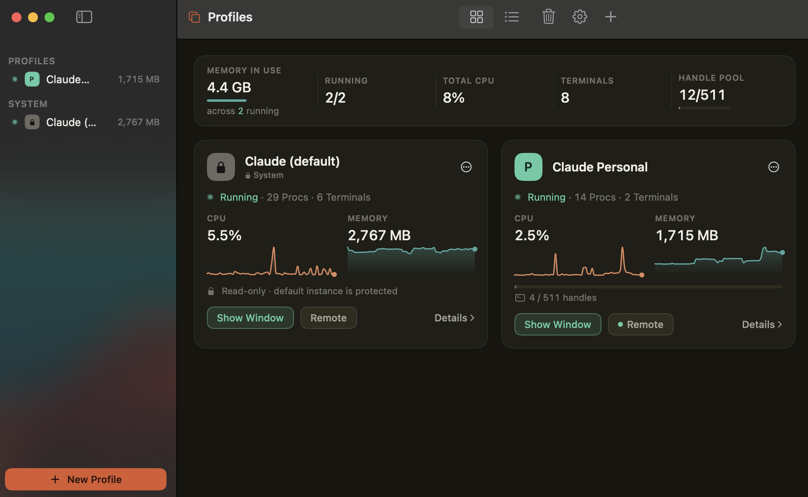
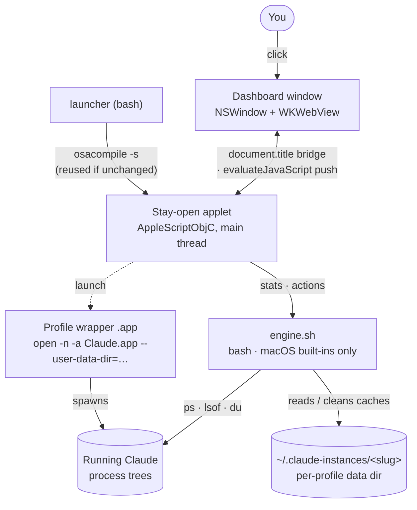

# Claude Profiles

[](https://github.com/jyito/Claude-Profiles/actions/workflows/ci.yml)
[](https://scorecard.dev/viewer/?uri=github.com/jyito/Claude-Profiles)
[](LICENSE)
[](#how-it-works-and-why-its-safe)
[](#requirements)

Run multiple Claude accounts side by side on one Mac — each in its own Claude Desktop instance, permanently signed in, with a native dashboard for live resource monitoring and one-click management.

<!-- HERO IMAGE — save as assets/hero-dashboard.png (≥1400px wide). Capture the dashboard window ONLY (⌘⇧5 → window) with 2+ running profiles and live sparklines. Earlier captures leaked Messages content — crop tight to the window. -->
<!--  — uncomment once the screenshot exists -->


<!-- DEMO VIDEO — drag a ~15s screen recording into the GitHub editor here once captured (ends on a Show Window jump). GitHub hosts the upload and rewrites this to a player. Keep the line below as the fallback link until then. -->
> 🎥 **[Demo video coming soon]** — a 15-second tour ending on a one-click Show Window jump.

> **Unofficial.** This is a community tool, not an Anthropic product, and is not affiliated with or endorsed by Anthropic. "Claude" is a trademark of Anthropic, PBC. The tool is a thin launcher around the official Claude Desktop app; it never modifies it.

## Why

Claude Desktop signs in one account at a time. If you have a personal Max plan and a business Max plan (or client accounts), switching means logging out and back in, constantly. Claude Profiles gives every account its own app icon — `Claude Business`, `Claude Personal`, `Claude Client X` — in your Dock, Spotlight, and Launchpad. Open as many as you like, simultaneously. Each stays signed in forever.

<!-- SCREENSHOT — save as assets/dock.png (≥800px wide). Your Dock showing several distinct Claude profile icons running at once. -->
<!--  — uncomment once the screenshot exists -->


## How it works (and why it's safe)

Claude Desktop is an Electron app. Launched with `--user-data-dir=<path>`, it keeps **all** of its session state — auth tokens, cookies, local storage, MCP config — inside that directory. Claude Profiles simply gives each account its own directory under `~/.claude-instances/` and generates a tiny native `.app` wrapper that launches the real Claude.app pointed at it.

That means:

- **No credential handling, ever.** The launcher never sees, stores, or transmits passwords or tokens. Claude Desktop manages its own session inside each profile's folder, exactly like two browser profiles.
- **No telemetry, no network connections.** The only stats are a small local text file per profile (launch history, last 50 entries) shown in the dashboard. Delete it any time.
- **No modification of Claude.app.** The official app's code signature stays intact; auto-updates keep working.
- **No dependencies.** Plain bash + AppleScriptObjC, all macOS built-ins. No Node, no Python, no Homebrew, no compilation.

## Features

- **One-click profiles** — create a profile from a dialog; a native app appears instantly with the real Claude icon. Sign in once; it's permanent.
- **Live dashboard** — a native window (NSWindow + WKWebView, spun up by `osascript`) showing each instance's CPU, memory, process count, terminals, and disk, with rolling sparklines, refreshed every 2 seconds. Stats are strictly per-instance: one account's numbers can never bleed into another's.
- **Per-instance drill-down** — expand any card in place. A *running* profile reveals a live table of its terminal sessions (device, command, idle time) with one-click close; a *stopped* profile reveals granular cleanup tiers — Caches / GPU / Logs / Everything. A **Throttle** control lowers a CPU-hogging instance's priority without quitting it.

  <!-- SCREENSHOT — save as assets/drilldown.png (≥1000px wide). An expanded running card showing the terminals table; crop to the card. -->
  <!--  — uncomment once the screenshot exists -->
- **Terminal-handle leak guard** — Claude Desktop leaks `/dev/ptmx` master handles (one per terminal session, never released); enough of them across instances can exhaust the system pool and wedge the whole Mac. The dashboard counts them per instance, shows a quiet *"N leaked"* stat once it matters, and offers a two-step **Restart to free handles** in **+ Details** — the only way to reclaim another process's handles. Optional auto-restart over a threshold heals it unattended.
- **Menu-bar switcher** — a menu-bar item lists every account; click one to focus or launch it without opening the dashboard.
- **Keyboard switching** — **⌘⌥1–9** focuses an instance while the dashboard is up; for the same chord *globally*, a copy-paste [Hammerspoon recipe](docs/HOTKEYS.md) drives the headless `engine focus` (your own optional tool — the app ships no global hooks).
- **Automatic maintenance (opt-in)** — Settings can auto-clear caches on stopped profiles over a size limit, auto-close terminals idle past a threshold, and auto-restart a leaking instance. All off by default and local-only.
- **Show Window** — with many instances and many windows, one click raises every window of a *specific* instance. It targets the process by PID via `NSRunningApplication`, which works even though all instances share Claude's bundle identifier — and needs no Accessibility permissions.
- **Cleanup utilities** — graceful quit, force-quit of a full process tree (releases stuck terminals), per-profile cache clearing, and an Emergency Stop killswitch. Cache clearing only ever deletes regenerable Electron caches; it refuses to run against a live instance and never touches sign-ins.
- **Safe removal** — deleting a profile's app takes one confirmation; deleting its saved login requires literally typing `DELETE`.
- **Graceful degradation** — if the dashboard window can't open on a given macOS version, the app automatically falls back to a native-dialog interface with the same capabilities.
- **Remote, from your iPad** — each card's **Remote** button runs that profile's Claude Code session in `screen` and shows copy-paste SSH lines (same-network and, with Tailscale, any-network) so you can **SSH into it from your iPad** — real remote sessions, no network server. A mint dot marks accounts whose session is already live, and the modal includes a **QR of the attach line** to read straight onto your phone's camera. (See [docs/REMOTE.md](docs/REMOTE.md).)
- **CLI for power users** — `cli/claude-profiles.sh` mirrors everything for scripting, plus a `code-alias` command for per-account [Claude Code](https://docs.claude.com/en/docs/claude-code/overview) config dirs and the same `remote` flow on the command line.

## Requirements

- **macOS 14 (Sonoma) or newer.** The dashboard and the one-click Show Window
  flow rely on macOS 14+ behaviour; older versions aren't supported.
- **[Claude Desktop](https://claude.ai/download)** installed (this tool launches
  the real app — it never bundles or modifies it).
- Nothing else: no Homebrew, Node, Python, or admin rights. It's bash +
  AppleScript + macOS built-ins, which is also why the download is so small.

## Install (users)

**[⬇ Download the latest release](https://github.com/jyito/Claude-Profiles/releases/latest)** — under **Assets**, grab `Claude-Profiles.dmg` (or `.zip`), then open it and drag **Claude Profiles.app** to Applications. The app is **unsigned** (open-source, no paid Apple cert yet), so macOS blocks the *first* launch — get past it once with **System Settings → Privacy & Security → Open Anyway**. Full steps and why it's safe: **[docs/INSTALL.md](docs/INSTALL.md)**.

## Build from source

```bash
git clone https://github.com/jyito/Claude-Profiles.git
cd Claude-Profiles
bash scripts/build.sh        # assembles dist/Claude Profiles.app (+ DMG on macOS)
bash tests/run-tests.sh      # full test suite, runs on macOS or Linux
```

There is no compile step — `build.sh` just assembles the bundle from `src/`.

## Repository layout

```
src/        the app: launcher (GUI manager), engine.sh (stats/actions),
            dashboard.html (window UI), dashboard.applescript (window host)
cli/        standalone CLI with the same engine
scripts/    build.sh (assemble bundle), make-dmg.sh (native DMG, macOS)
docs/       INSTALL.md (end users), REMOTE.md (terminal access), ARCHITECTURE.md (how it all works)
tests/      Linux-compatible suite with shimmed macOS tools
```

## Architecture in one paragraph

A profile is a generated `.app` bundle whose entire executable is a short bash script: `open -n -a Claude.app --args --user-data-dir=~/.claude-instances/<slug>`. The manager app is the same kind of bundle, with a menu. The dashboard is a WKWebView in an NSWindow created by AppleScriptObjC through plain `osascript`; the page's buttons communicate to native code by setting `document.title` (polled every 0.25 s — a block-free, subclass-free bridge), and native pushes JSON stats back with `evaluateJavaScript`. Stats come from `engine.sh`, which attributes processes to instances by their `--user-data-dir` argument and walks the child tree for helpers. Full detail in [docs/ARCHITECTURE.md](docs/ARCHITECTURE.md).



## Known limitations

- **Gatekeeper**: downloaded releases are unsigned, so the first launch is blocked once — clear it with **System Settings → Privacy & Security → Open Anyway** (the old right-click → Open shortcut was removed in macOS 15; see [docs/INSTALL.md](docs/INSTALL.md)). Apps the manager generates locally carry no quarantine and open normally.
- **Deep-link logins**: macOS routes `claude://` callbacks to one instance. If a browser login lands in the wrong window, use the login page's copy-code option. Once per profile.
- **Spaces**: "Assign to Desktop" is unreliable across instances sharing a bundle ID; drag windows to Spaces manually and macOS remembers per session.
- **Memory**: every instance is a full Electron app. The dashboard exists partly so you can see exactly what that costs.
- **Show Window** raises all of an instance's windows (not one specific window); per-window control would require Accessibility permissions.
- **Running instances are all named "Claude"** in the menu bar, ⌘-Tab, and the running Dock icon — because every profile launches the real, unmodified `Claude.app`. The per-profile **badge** distinguishes the launcher icons, and **Show Window** raises a specific instance by PID. Giving each running app its own name would require a renamed copy of Claude.app per profile, which breaks its code signature, defeats auto-updates, and (verified) trips Electron's integrity checks — see [docs/branded-apps-spike.md](docs/branded-apps-spike.md). It's a deliberate trade-off of the zero-modification design.

## Roadmap

- [x] Per-profile icon badging (distinct Dock/Spotlight icon per account)
- [x] Menu-bar quick switcher
- [x] Keyboard profile switching (⌘⌥1–9 + optional global Hammerspoon recipe)
- [ ] Developer ID signing + notarization for friction-free public distribution
- [ ] Homebrew cask (`brew install --cask claude-profiles`) — follows signing
- [ ] Compiled SwiftUI dashboard (current window host is AppleScriptObjC by design — zero deps — but a signed Swift app unlocks richer UI)

## Contributing

See [CONTRIBUTING.md](CONTRIBUTING.md). Run `tests/run-tests.sh` before sending a PR — it runs anywhere, no Mac required for the bash/JS layers.

## Attribution

This project is Apache-2.0 licensed: use it freely, including commercially,
with an explicit patent grant. Apache's Section 4(d) makes the [NOTICE](NOTICE)
file travel with the code — redistributions and derivative works must carry
its attribution notices forward. The NOTICE adds one human request on top:
if you ship something substantially derived from this, credit the project
and get in touch. Acknowledgment is the whole economy of open source.

## License

[Apache-2.0](LICENSE)
